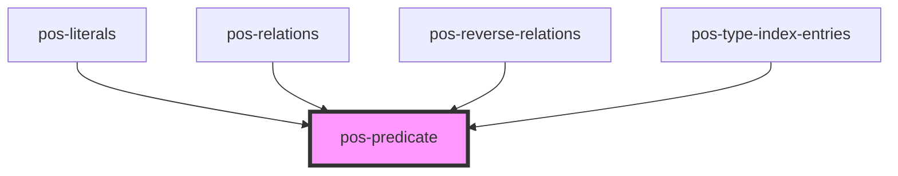

# pos-predicate

<!-- Auto Generated Below -->

## Overview

Displays an RDF term (predicate) in a human-friendly way, using a provided label. The user can still expand the label
to the full URI to see the actual predicate.

This will only show the predicate itself, not any value. If you want to display a value, use [pos-value](../pos-value) instead.

## Properties

| Property | Attribute | Description                                         | Type     | Default     |
| -------- | --------- | --------------------------------------------------- | -------- | ----------- |
| `label`  | `label`   | The human-readable label to show for this predicate | `string` | `undefined` |
| `uri`    | `uri`     | The full URI of the predicate                       | `string` | `undefined` |

## Dependencies

### Used by

 - [pos-literals](../pos-literals)
 - [pos-relations](../pos-relations)
 - [pos-reverse-relations](../pos-reverse-relations)
 - [pos-type-index-entries](../pos-type-index-entries)

### Graph

----------------------------------------------

*Built with [StencilJS](https://stenciljs.com/)*
