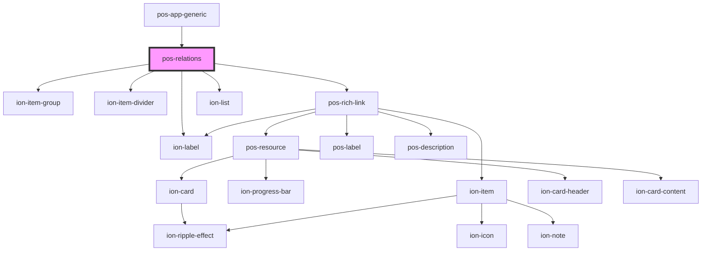

# pos-relations

<!-- Auto Generated Below -->

## Events

| Event             | Description | Type               |
| ----------------- | ----------- | ------------------ |
| `pod-os:resource` |             | `CustomEvent<any>` |

## Dependencies

### Used by

 - [pos-app-generic](../../apps/pos-app-generic)

### Depends on

- ion-item-group
- ion-item-divider
- ion-label
- [pos-rich-link](../pos-rich-link)
- ion-list

### Graph

----------------------------------------------

*Built with [StencilJS](https://stenciljs.com/)*
