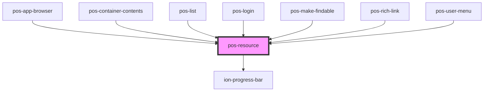

# pos-resource

<!-- Auto Generated Below -->

## Properties

| Property | Attribute | Description | Type      | Default     |
| -------- | --------- | ----------- | --------- | ----------- |
| `lazy`   | `lazy`    |             | `boolean` | `false`     |
| `uri`    | `uri`     |             | `string`  | `undefined` |

## Events

| Event                    | Description                                                          | Type               |
| ------------------------ | -------------------------------------------------------------------- | ------------------ |
| `pod-os:init`            |                                                                      | `CustomEvent<any>` |
| `pod-os:resource-loaded` | Indicates that the resource given in `uri` property has been loaded. | `CustomEvent<any>` |

## Methods

### `fetch() => Promise<void>`

#### Returns

Type: `Promise<void>`

## Dependencies

### Used by

 - [pos-app-browser](../../apps/pos-app-browser)
 - [pos-container-contents](../pos-container-contents)
 - [pos-list](../pos-list)
 - [pos-login](../pos-login)
 - [pos-make-findable](../pos-make-findable)
 - [pos-rich-link](../pos-rich-link)
 - [pos-user-menu](../pos-user-menu)

### Depends on

- ion-progress-bar

### Graph

----------------------------------------------

*Built with [StencilJS](https://stenciljs.com/)*
