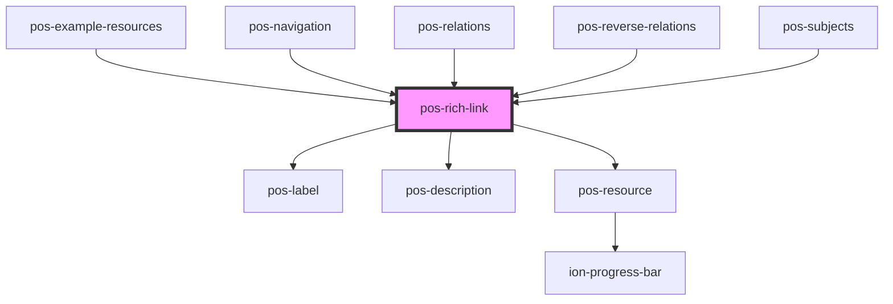

# pos-rich-link

<!-- Auto Generated Below -->

## Properties

| Property | Attribute | Description                                                                               | Type     | Default     |
| -------- | --------- | ----------------------------------------------------------------------------------------- | -------- | ----------- |
| `rel`    | `rel`     | Link will be obtained by following the predicate with this URI forward from a resource    | `string` | `undefined` |
| `rev`    | `rev`     | Link will be obtained by following the predicate with this URI in reverse from a resource | `string` | `undefined` |
| `uri`    | `uri`     | Link will use this URI                                                                    | `string` | `undefined` |

## Events

| Event             | Description | Type               |
| ----------------- | ----------- | ------------------ |
| `pod-os:error`    |             | `CustomEvent<any>` |
| `pod-os:link`     |             | `CustomEvent<any>` |
| `pod-os:resource` |             | `CustomEvent<any>` |

## Dependencies

### Used by

 - [pos-example-resources](../../apps/pos-app-dashboard/pos-example-resources)
 - [pos-navigation](../pos-navigation)
 - [pos-relations](../pos-relations)
 - [pos-reverse-relations](../pos-reverse-relations)
 - [pos-subjects](../pos-subjects)

### Depends on

- [pos-label](../pos-label)
- [pos-description](../pos-description)
- [pos-resource](../pos-resource)

### Graph

----------------------------------------------

*Built with [StencilJS](https://stenciljs.com/)*
