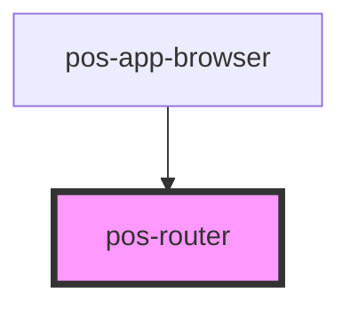

# pos-router

<!-- Auto Generated Below -->

## Overview

The responsibility of pos-router is to handle the `uri` query param, that specifies the URI of the resource that is currently opened.
It reads this query param and informs other components about changes via the `pod-os:route-changed` event.
It also intercepts the URLs from `pod-os:link` events and pushes them as a new `uri` parameter.

## Events

| Event                  | Description                      | Type                  |
| ---------------------- | -------------------------------- | --------------------- |
| `pod-os:route-changed` | Emits the new URI that is active | `CustomEvent<string>` |

## Dependencies

### Used by

 - [pos-app-browser](../../apps/pos-app-browser)

### Graph

----------------------------------------------

*Built with [StencilJS](https://stenciljs.com/)*
