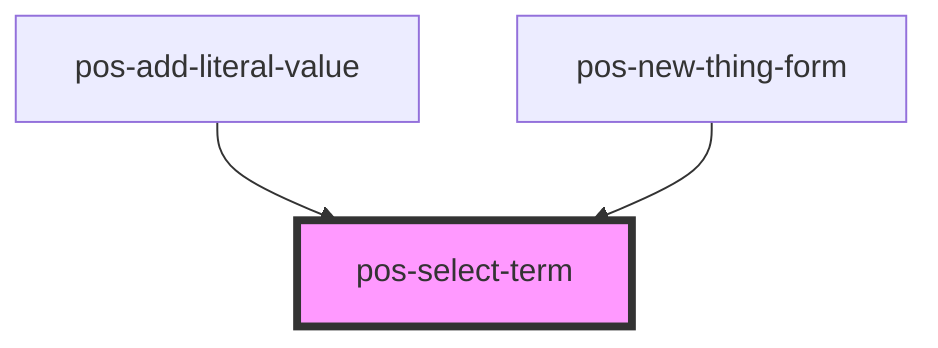

# pos-select-term

<!-- Auto Generated Below -->

## Properties

| Property      | Attribute     | Description | Type     | Default               |
| ------------- | ------------- | ----------- | -------- | --------------------- |
| `placeholder` | `placeholder` |             | `string` | `'Type to search...'` |
| `value`       | `value`       |             | `string` | `''`                  |

## Events

| Event                  | Description                              | Type               |
| ---------------------- | ---------------------------------------- | ------------------ |
| `pod-os:init`          |                                          | `CustomEvent<any>` |
| `pod-os:term-selected` | Fires when a term is entered or selected | `CustomEvent<any>` |

## Shadow Parts

| Part      | Description |
| --------- | ----------- |
| `"input"` |             |
| `"terms"` |             |

## Dependencies

### Used by

 - [pos-add-literal-value](../pos-add-literal-value)
 - [pos-new-thing-form](../pos-new-thing-form)

### Graph

----------------------------------------------

*Built with [StencilJS](https://stenciljs.com/)*
