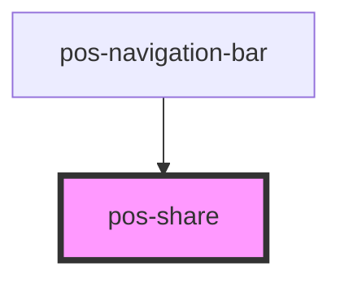

# pos-share

<!-- Auto Generated Below -->

## Overview

Allows sharing a resource with other apps, people, etc.

## Properties

| Property           | Attribute | Description                   | Type     | Default     |
| ------------------ | --------- | ----------------------------- | -------- | ----------- |
| `uri` _(required)_ | `uri`     | URI of the resource to share. | `string` | `undefined` |

## Shadow Parts

| Part       | Description |
| ---------- | ----------- |
| `"button"` |             |

## Dependencies

### Used by

 - [pos-navigation-bar](../pos-navigation/bar)

### Graph

----------------------------------------------

*Built with [StencilJS](https://stenciljs.com/)*
