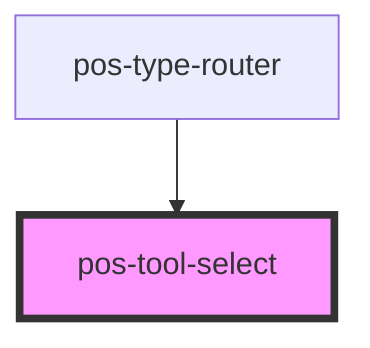

<!-- Auto Generated Below -->

## Overview

Allows selecting a tool from within a set of available tools

## Properties

| Property   | Attribute | Description                         | Type           | Default     |
| ---------- | --------- | ----------------------------------- | -------------- | ----------- |
| `selected` | --        | The tool that is currently selected | `ToolConfig`   | `undefined` |
| `tools`    | --        | All tools that are available        | `ToolConfig[]` | `[]`        |

## Events

| Event                  | Description | Type                      |
| ---------------------- | ----------- | ------------------------- |
| `pod-os:tool-selected` |             | `CustomEvent<ToolConfig>` |

## Dependencies

### Used by

 - [pos-type-router](../pos-type-router)

### Graph

----------------------------------------------

*Built with [StencilJS](https://stenciljs.com/)*
