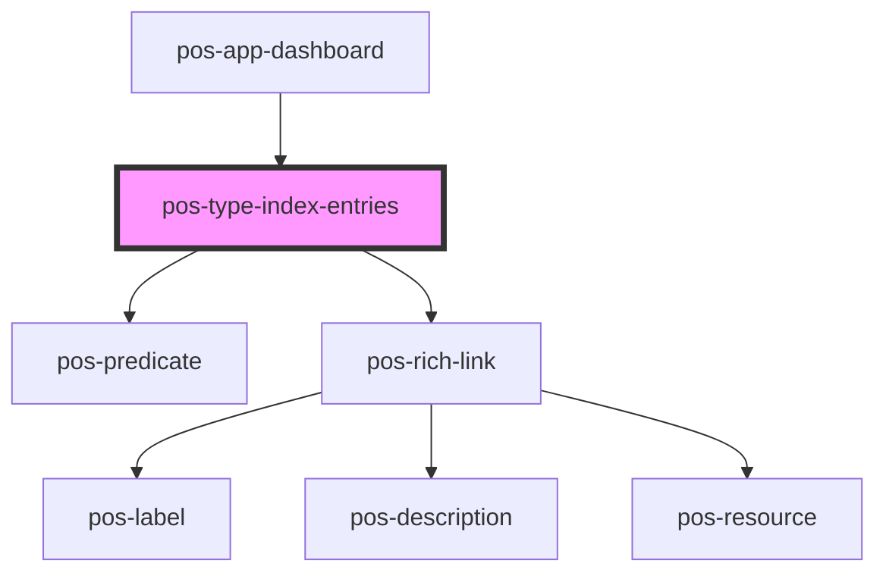

# pos-type-index-entries

<!-- Auto Generated Below -->

## Properties

| Property | Attribute | Description | Type     | Default     |
| -------- | --------- | ----------- | -------- | ----------- |
| `uri`    | `uri`     |             | `string` | `undefined` |

## Dependencies

### Used by

 - [pos-app-dashboard](../../apps/pos-app-dashboard)

### Depends on

- [pos-predicate](../pos-predicate)
- [pos-rich-link](../pos-rich-link)

### Graph

----------------------------------------------

*Built with [StencilJS](https://stenciljs.com/)*
