# pos-type-router

<!-- Auto Generated Below -->

## Events

| Event             | Description | Type               |
| ----------------- | ----------- | ------------------ |
| `pod-os:resource` |             | `CustomEvent<any>` |

## Dependencies

### Used by

 - [pos-router](../pos-router)

### Depends on

- [pos-app-rdf-document](../../apps/pos-app-rdf-document)
- [pos-app-generic](../../apps/pos-app-generic)

### Graph

```mermaid
graph TD;
  pos-type-router --> pos-app-rdf-document
  pos-type-router --> pos-app-generic
  pos-app-rdf-document --> ion-grid
  pos-app-rdf-document --> ion-row
  pos-app-rdf-document --> ion-col
  pos-app-rdf-document --> pos-subjects
  pos-app-rdf-document --> ion-card
  pos-app-rdf-document --> ion-card-header
  pos-app-rdf-document --> ion-card-title
  pos-app-rdf-document --> pos-label
  pos-app-rdf-document --> pos-type-badges
  pos-app-rdf-document --> pos-literals
  pos-subjects --> pos-rich-link
  pos-subjects --> ion-list
  pos-rich-link --> pos-resource
  pos-rich-link --> ion-item
  pos-rich-link --> ion-label
  pos-rich-link --> pos-label
  pos-rich-link --> pos-description
  pos-resource --> ion-progress-bar
  ion-item --> ion-icon
  ion-item --> ion-ripple-effect
  ion-card --> ion-ripple-effect
  pos-type-badges --> ion-badge
  pos-literals --> ion-item-group
  pos-literals --> ion-item-divider
  pos-literals --> ion-label
  pos-literals --> ion-item
  pos-literals --> ion-list
  pos-app-generic --> ion-grid
  pos-app-generic --> ion-row
  pos-app-generic --> ion-col
  pos-app-generic --> ion-card
  pos-app-generic --> ion-card-header
  pos-app-generic --> pos-type-badges
  pos-app-generic --> pos-picture
  pos-app-generic --> ion-card-title
  pos-app-generic --> pos-label
  pos-app-generic --> ion-card-content
  pos-app-generic --> pos-description
  pos-app-generic --> pos-literals
  pos-app-generic --> pos-relations
  pos-app-generic --> pos-reverse-relations
  pos-picture --> pos-image
  pos-image --> ion-skeleton-text
  pos-image --> ion-icon
  pos-relations --> ion-item-group
  pos-relations --> ion-item-divider
  pos-relations --> ion-label
  pos-relations --> pos-rich-link
  pos-relations --> ion-list
  pos-reverse-relations --> ion-item-group
  pos-reverse-relations --> ion-item-divider
  pos-reverse-relations --> ion-label
  pos-reverse-relations --> pos-rich-link
  pos-reverse-relations --> ion-list
  pos-router --> pos-type-router
  style pos-type-router fill:#f9f,stroke:#333,stroke-width:4px
```

----------------------------------------------

*Built with [StencilJS](https://stenciljs.com/)*
