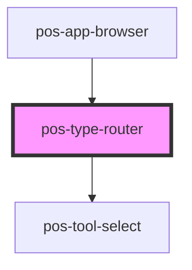

# pos-type-router

<!-- Auto Generated Below -->

## Overview

This component is responsible for rendering tools that are useful to interact with the current resource.

## Events

| Event             | Description | Type               |
| ----------------- | ----------- | ------------------ |
| `pod-os:resource` |             | `CustomEvent<any>` |

## Dependencies

### Used by

 - [pos-app-browser](../../apps/pos-app-browser)

### Depends on

- [pos-tool-select](../pos-tool-select)

### Graph

----------------------------------------------

*Built with [StencilJS](https://stenciljs.com/)*
