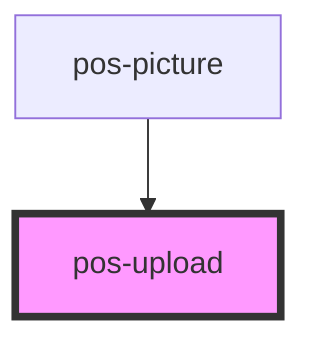

# pos-upload

<!-- Auto Generated Below -->

## Properties

| Property | Attribute | Description                                                          | Type     | Default     |
| -------- | --------- | -------------------------------------------------------------------- | -------- | ----------- |
| `accept` | `accept`  | The accepted file types, as defined by the HTML5 `accept` attribute. | `string` | `'image/*'` |

## Events

| Event                   | Description                                        | Type                    |
| ----------------------- | -------------------------------------------------- | ----------------------- |
| `pod-os:files-selected` | Fires when files are selected from the file input. | `CustomEvent<FileList>` |

## Dependencies

### Used by

 - [pos-picture](../pos-picture)

### Graph

----------------------------------------------

*Built with [StencilJS](https://stenciljs.com/)*
