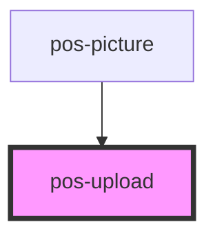

# pos-upload

<!-- Auto Generated Below -->

## Properties

| Property   | Attribute | Description              | Type                                                                           | Default       |
| ---------- | --------- | ------------------------ | ------------------------------------------------------------------------------ | ------------- |
| `accept`   | --        | The accepted file types. | `string[]`                                                                     | `['image/*']` |
| `uploader` | --        |                          | `(file: File) => ResultAsync<{ url: string; }, HttpProblem \| NetworkProblem>` | `undefined`   |

## Dependencies

### Used by

 - [pos-picture](../pos-picture)

### Graph

----------------------------------------------

*Built with [StencilJS](https://stenciljs.com/)*
