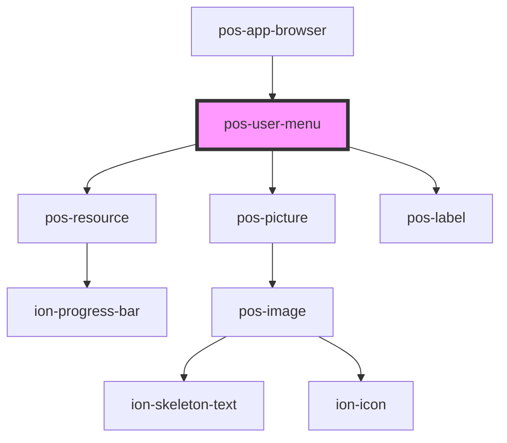

# pos-user-menu

<!-- Auto Generated Below -->

## Properties

| Property             | Attribute | Description | Type     | Default     |
| -------------------- | --------- | ----------- | -------- | ----------- |
| `webId` _(required)_ | `web-id`  |             | `string` | `undefined` |

## Events

| Event           | Description | Type               |
| --------------- | ----------- | ------------------ |
| `pod-os:link`   |             | `CustomEvent<any>` |
| `pod-os:logout` |             | `CustomEvent<any>` |

## Dependencies

### Used by

 - [pos-app-browser](../../apps/pos-app-browser)

### Depends on

- [pos-resource](../pos-resource)
- [pos-picture](../pos-picture)
- [pos-label](../pos-label)

### Graph

----------------------------------------------

*Built with [StencilJS](https://stenciljs.com/)*
