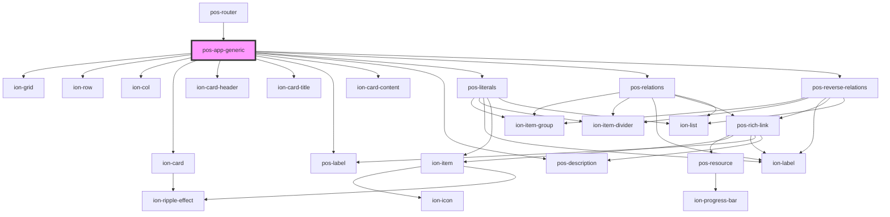

# pos-app-generic

<!-- Auto Generated Below -->

## Dependencies

### Used by

 - [pos-router](../../components/pos-router)

### Depends on

- ion-grid
- ion-row
- ion-col
- ion-card
- ion-card-header
- ion-card-title
- [pos-label](../../components/pos-label)
- ion-card-content
- [pos-description](../../components/pos-description)
- [pos-literals](../../components/pos-literals)
- [pos-relations](../../components/pos-relations)
- [pos-reverse-relations](../../components/pos-reverse-relations)

### Graph

----------------------------------------------

*Built with [StencilJS](https://stenciljs.com/)*
