# pos-demo-app

<!-- Auto Generated Below -->

## Dependencies

### Depends on

- [pos-app](../pos-app)
- ion-header
- ion-toolbar
- ion-title
- [pos-login](../pos-login)
- ion-content
- [pos-resource](../pos-resource)
- ion-grid
- ion-row
- ion-col
- ion-card
- ion-card-header
- ion-card-subtitle
- ion-card-title
- [pos-label](../pos-label)
- ion-card-content
- [pos-description](../pos-description)
- [pos-literals](../pos-literals)
- [pos-relations](../pos-relations)
- ion-footer

### Graph

```mermaid
graph TD;
  pos-demo-app --> pos-app
  pos-demo-app --> ion-header
  pos-demo-app --> ion-toolbar
  pos-demo-app --> ion-title
  pos-demo-app --> pos-login
  pos-demo-app --> ion-content
  pos-demo-app --> pos-resource
  pos-demo-app --> ion-grid
  pos-demo-app --> ion-row
  pos-demo-app --> ion-col
  pos-demo-app --> ion-card
  pos-demo-app --> ion-card-header
  pos-demo-app --> ion-card-subtitle
  pos-demo-app --> ion-card-title
  pos-demo-app --> pos-label
  pos-demo-app --> ion-card-content
  pos-demo-app --> pos-description
  pos-demo-app --> pos-literals
  pos-demo-app --> pos-relations
  pos-demo-app --> ion-footer
  pos-app --> ion-app
  pos-login --> pos-resource
  pos-login --> pos-label
  pos-login --> ion-button
  pos-resource --> ion-progress-bar
  ion-button --> ion-ripple-effect
  ion-card --> ion-ripple-effect
  pos-literals --> ion-item-group
  pos-literals --> ion-item-divider
  pos-literals --> ion-label
  pos-literals --> ion-item
  pos-literals --> ion-list
  ion-item --> ion-icon
  ion-item --> ion-ripple-effect
  pos-relations --> ion-item-group
  pos-relations --> ion-item-divider
  pos-relations --> ion-label
  pos-relations --> pos-rich-link
  pos-relations --> ion-list
  pos-rich-link --> pos-resource
  pos-rich-link --> ion-item
  pos-rich-link --> ion-label
  pos-rich-link --> pos-label
  pos-rich-link --> pos-description
  style pos-demo-app fill:#f9f,stroke:#333,stroke-width:4px
```

----------------------------------------------

*Built with [StencilJS](https://stenciljs.com/)*
