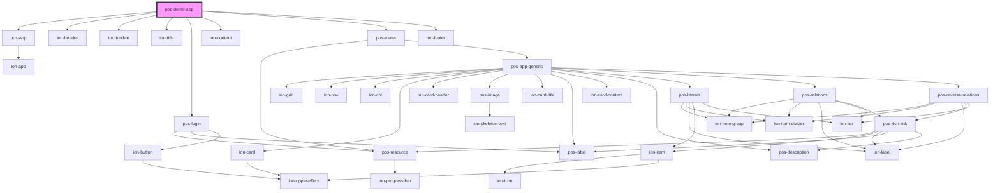

# pos-demo-app

<!-- Auto Generated Below -->

## Dependencies

### Depends on

- [pos-app](../pos-app)
- ion-header
- ion-toolbar
- ion-title
- [pos-login](../pos-login)
- ion-content
- [pos-router](../pos-router)
- ion-footer

### Graph

----------------------------------------------

*Built with [StencilJS](https://stenciljs.com/)*
