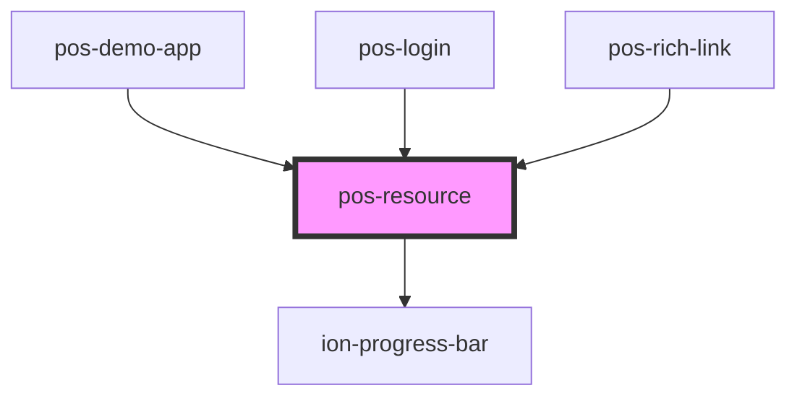

# pos-resource

<!-- Auto Generated Below -->

## Properties

| Property | Attribute | Description | Type      | Default     |
| -------- | --------- | ----------- | --------- | ----------- |
| `lazy`   | `lazy`    |             | `boolean` | `false`     |
| `uri`    | `uri`     |             | `string`  | `undefined` |

## Events

| Event         | Description | Type               |
| ------------- | ----------- | ------------------ |
| `pod-os:init` |             | `CustomEvent<any>` |

## Methods

### `fetch() => Promise<void>`

#### Returns

Type: `Promise<void>`

## Dependencies

### Used by

 - [pos-demo-app](../pos-demo-app)
 - [pos-login](../pos-login)
 - [pos-rich-link](../pos-rich-link)

### Depends on

- ion-progress-bar

### Graph

----------------------------------------------

*Built with [StencilJS](https://stenciljs.com/)*
