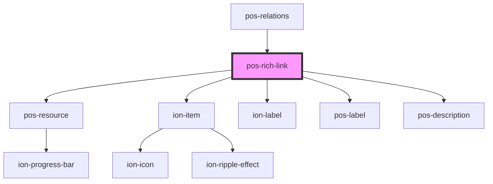

# pos-rich-link

<!-- Auto Generated Below -->

## Properties

| Property | Attribute | Description | Type     | Default     |
| -------- | --------- | ----------- | -------- | ----------- |
| `uri`    | `uri`     |             | `string` | `undefined` |

## Dependencies

### Used by

 - [pos-relations](../pos-relations)

### Depends on

- [pos-resource](../pos-resource)
- ion-item
- ion-label
- [pos-label](../pos-label)
- [pos-description](../pos-description)

### Graph

----------------------------------------------

*Built with [StencilJS](https://stenciljs.com/)*
