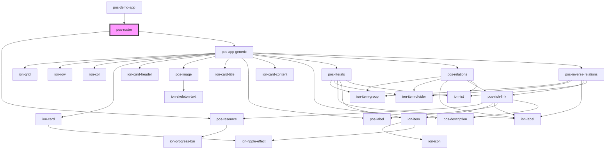

# pos-router

<!-- Auto Generated Below -->

## Dependencies

### Used by

 - [pos-demo-app](../pos-demo-app)

### Depends on

- [pos-resource](../pos-resource)
- [pos-app-generic](../../apps/pos-app-generic)

### Graph

----------------------------------------------

*Built with [StencilJS](https://stenciljs.com/)*
