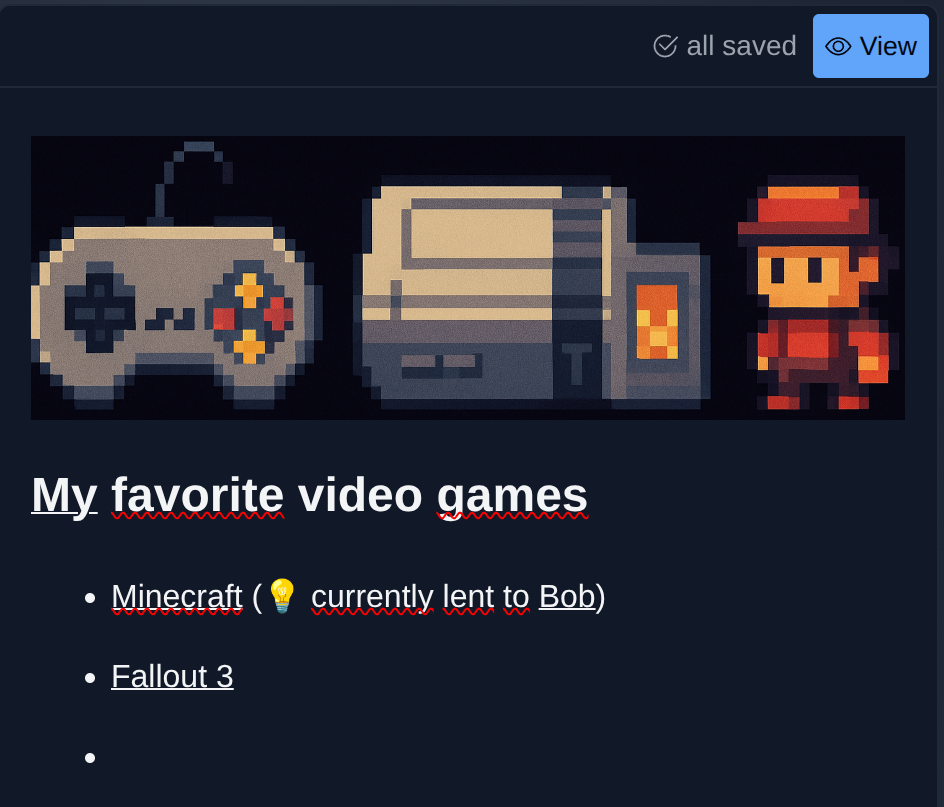
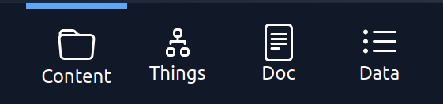
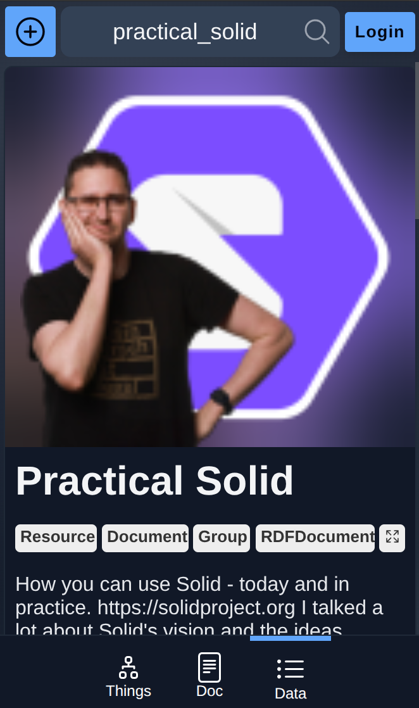

---
date:
  created: 2025-10-26
---

# PodOS 2025.10 is out 🎉

The new release adds create new features to PodOS Browser, including a smoother authentication experience, markdown support and a better integration with the Fediverse.

## From informal notes to structured knowledge

{ align=right width="300" }

Often you just want to note some facts quickly, and Markdown is the way to go for many of us.

PodOS 2025.10 allows you to open your existing Markdown documents, renders them nicely and even allows you to edit them using a What-You-See-Is-What-You-Get editor.

In the future, we are going to integrate that editor with the structured knowledge you store on your Pod, transitioning smoothly from quick notes to knowledge graphs.

## The right tool for the job

{ align=right width="300" }

We want you to focus on your use cases and choose the right tool for the job. Sometimes you want to mess around with the data in your documents, but more often specialized tools give a much better user experience.

PodOS 2025.10 allows you to switch between all suitable tools for a given resource. The generic data viewer is always available, but if specialized tools fit, those will be opened by default, like the new Markdown Editor for Markdown documents

## Smoother authentication experience

Authentication can still be a pain in Solid Apps. PodOS 2025.10 switched to a new authentication library, which improves the experience significantly. You should see fewer login redirects and authorization requests with the new release.

## Fediverse + Solid = ❤️

{ align=right width="300" }

Fediverse applications are built on Linked Data, the same technology Solid is based on. PodOS 2025.10 improves the integration with Fediverse applications by fixing several issues with JSON-LD - a serialization format often used in the Fediverse.

Check it out by [opening the Practical Solid Video channel](https://browser.pod-os.org/?uri=https%3A%2F%2Ftube.tchncs.de%2Fvideo-channels%2Fpractical_solid&tool=pos-app-generic) from PeerTube in PodOS Browser!

## Full release notes

PodOS 2025.10 includes the following components:

 - @pod-os/elements 0.31.0
 - @pod-os/core 0.20.0

For those of you interested in the full list of changes, here are the release notes:

- [@pod-os/elements](https://github.com/pod-os/PodOS/blob/2025-10/elements/CHANGELOG.md#changelog)
- [@pod-os/core](https://github.com/pod-os/PodOS/blob/2025-10/core/CHANGELOG.md#changelog)