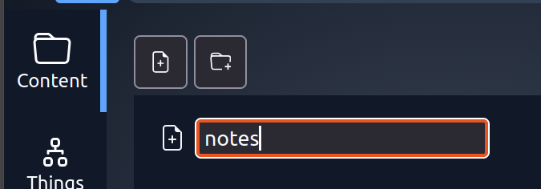
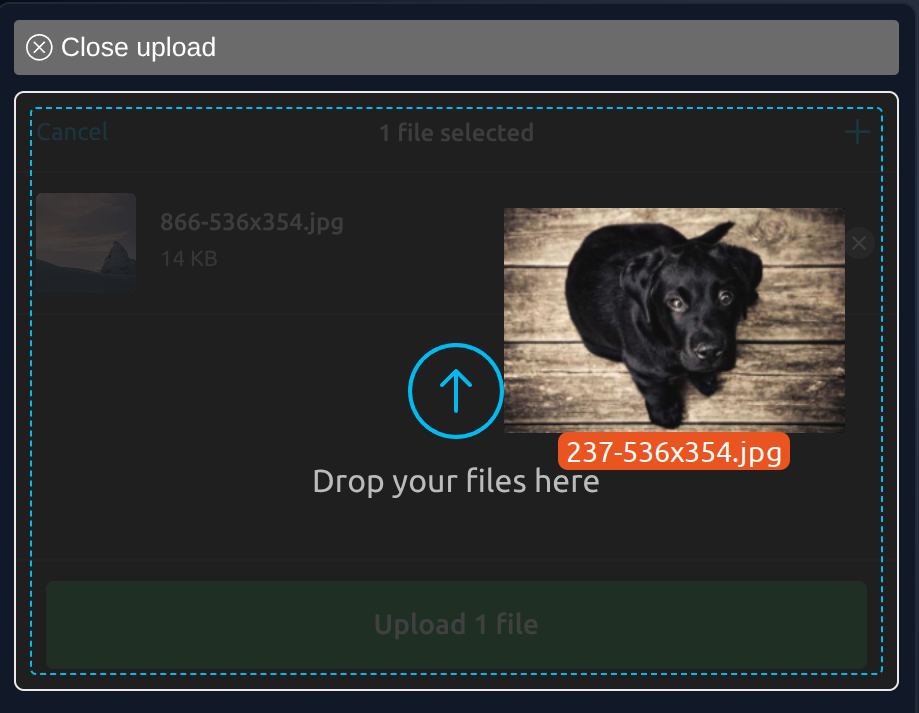
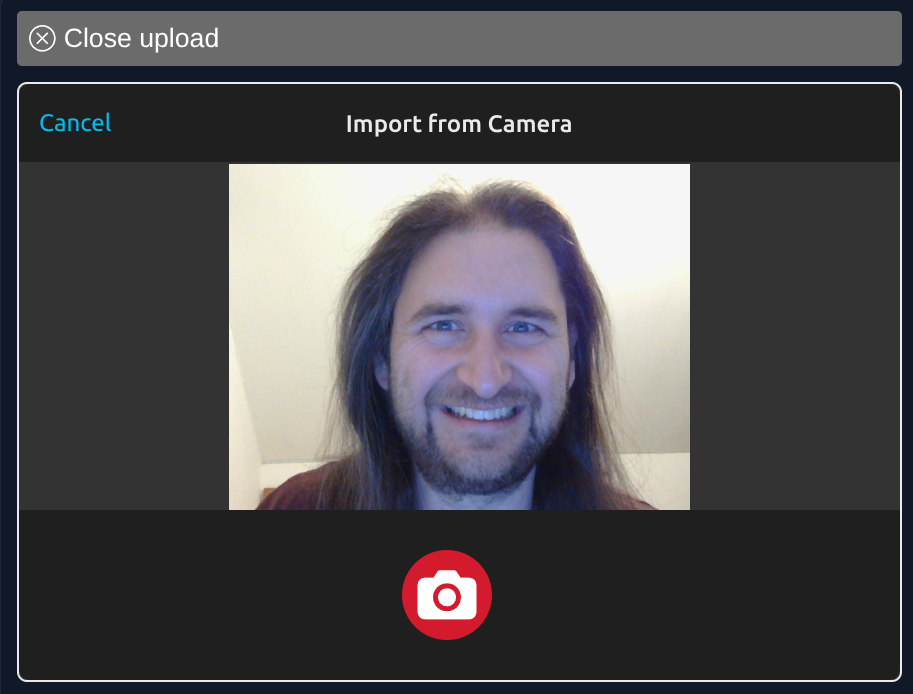

---
date:
  created: 2025-11-27
---

# Files and more with PodOS 2025.11

Our latest release helps to organize your stuff in files and folders and visualize your things using pictures.

## The hierarchy of things

Linked data helps to organize things in relation to each other and build a knowledge graph. PodOS 2025.11
allows you to create folders and files in your Pod to organize them in a traditional hierarchy as well.

{ align=right width="300" }

File types are recognized by extensions, so you can create Turtle files for RDF data as well as JSON, plain text, Markdown and more (have
you tried the Markdown editor introduced with [PodOS 2025.10](./pod-os-2025-10-is-out.md)?)

## Pics or it didn't happen

{ align=left width="150" }
{ align=right width="150" }

Uploading pictures is finally there! Go and add a nice visual to things of importance to you. Use drag and drop, or
browse your file system — whatever you prefer.

Thanks to [Uppy](https://uppy.io/) this also includes taking a picture directly from your webcam. How about adding that
long-missing profile picture today?

## Lists, lists, lists

Good news for the dashboard aficionados among you: Building lists of things is now possible with
the [`pos-list`](../../../reference/elements/components/pos-list/index.md) element.

This way you can build a simple friends list with a few lines of HTML:

```html
<pos-resource uri="https://alice.solid.example/profile/card#me">
  <ul>
    <pos-list rel="http://xmlns.com/foaf/0.1/knows" fetch>
      <template>
        <li><pos-label></pos-label></li>
      </template>
    </pos-list>
  </ul>
</pos-resource>
```

You can also list all things of a certain type that have been fetched so far:

```html
<!-- Fetch happens anywhere else in the document -->
<ul>
    <pos-list all-from-store if-typeof="http://www.w3.org/2002/01/bookmark#Bookmark">
        <template>
            <li><pos-label></pos-label></li>
        </template>
    </pos-list>
</ul>
```

It is quite impressive what can be done with PodOS elements already. [Angelo](https://angelo.veltens.org/profile/card#me) built a whole [profile page](https://angelo.veltens.org/pod-os/profile.html) making extensive use of the new list element.

Built something yourself using PodOS? [Let us know](mailto:contact+2025.11@pod-os.org), and we are happy to showcase your work!

## Full changelogs

PodOS 2025.11 includes the following components:

- @pod-os/elements 0.34.0
- @pod-os/core 0.23.0

For those of you interested in the full list of changes, here are the release notes:

- [@pod-os/elements](https://github.com/pod-os/PodOS/blob/2025.11/elements/CHANGELOG.md#changelog)
- [@pod-os/core](https://github.com/pod-os/PodOS/blob/2025.11/core/CHANGELOG.md#changelog)