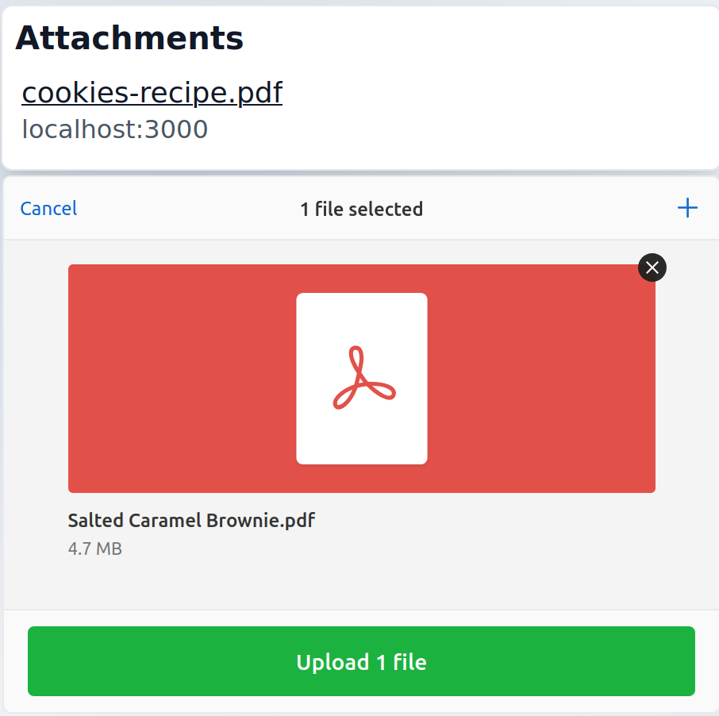
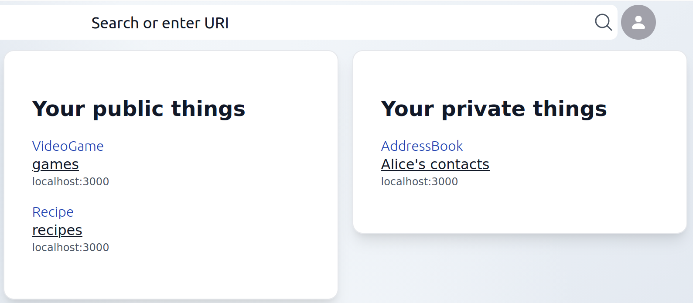

---
date:
  created: 2025-12-22
---

# PodOS 2025.12 brings attachments and discovery 

The latest release makes it easier to connect files to your digital things and
discover your data through the dashboard.

## Connecting files to digital twins

Imagine you're cataloging your belongings on your Pod - you have digital
representations of your devices, appliances, or other possessions. But what
about the PDF manual, the warranty document, or the invoice that came with your
new coffee machine?

{ align=right width="300" }

PodOS Browser 2025.12 introduces attachments - a way to connect classic files
like PDFs, images, or documents to the digital twins of things on your Pod.
Store the invoice for your laptop right alongside its digital representation, or
keep instruction manuals attached to the things they belong to.

When you open any resource in PodOS Browser, you can now view all its
attachments in one place and add new ones. Everything stays connected and easy
to find.

## Your personal catalog

Your Pod contains all sorts of data - but how do you keep track of what's where?
The dashboard now gives you a better overview of your personal data space.

{ align=left width="300" }

With this release, the dashboard shows your public and private type index
entries in clean, card-style containers. Think of it as an organized catalog of
everything in your Pod - all your bookmarks here, your photos there, your
contacts in another place. At a glance, you can see what kinds of things you're storing and navigate directly to where they live.

## Full changelogs

PodOS 2025.12 includes the following components:

- @pod-os/elements 0.35.0
- @pod-os/core 0.24.0

For those of you interested in the full list of changes, here are the release
notes:

- [@pod-os/elements](https://github.com/pod-os/PodOS/blob/2025.12/elements/CHANGELOG.md#changelog)
- [@pod-os/core](https://github.com/pod-os/PodOS/blob/2025.12/core/CHANGELOG.md#changelog)
