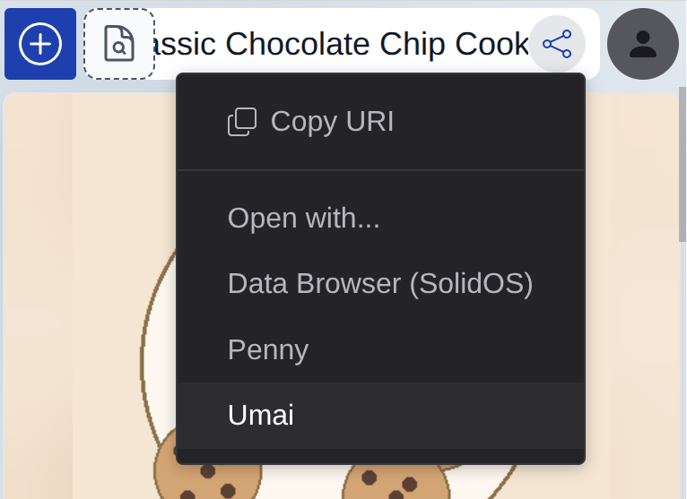

---
date:
  created: 2026-03-04
---

# PodOS 2026.03: "Open with", conditional rendering and reactivity

Browsing your data using PodOS is great, but nothing compares to an app that is tailor-made for the task. That's why PodOS Brower now allows you to open a resource in another app. We also have some exciting new features for dashboards builders.

## The right app, just when you need it

Having a choice: This is a key promise of the Solid ecosystem, and with the latest PodOS release we make this choice available with just two clicks: Press "Share", select an app, seamlessly continue your work. That's it!

{ align=right width="300" }

Viewing a recipe? Open with Umai and start cooking. Working with an address book? Switch over to PodOS Contacts. Need to edit a web page? Dokie.li is at your service.

The current release comes with support for several well-known and proven Solid applications. We are going to make this configurable to work with any Solid app in the future.

## What if? One dashboard countless possibilities

Your data is as diverse as your life. When building HTML dashboards, you might want to react differently depending on the type and properties of things. This is where [`pos-switch`](http://pod-os.org/reference/elements/components/pos-switch/) comes into play! A new component for conditional rendering.

With this new element you can choose an appropriate HTML template for different cases. Here is an example:

```html
<pos-switch>
  <pos-case if-typeof="http://schema.org/Recipe">
    <template>Whatever you want to render for a recipe</template>
  </pos-case>
  <pos-case else if-typeof="http://schema.org/Person">
    <template>This renders in case it is a person</template>
  </pos-case>
  <pos-case if-property="http://www.w3.org/2006/vcard/ns#hasPhoto">
    <template>
      The resource has a photo, let's show it: <pos-picture></pos-picture>
    </template>
  </pos-case>
</pos-switch>
```

Take a look at [Storybook](https://pod-os.github.io/PodOS/storybook/?path=/docs/basics--pos-switch) for more examples and playing around with it.

## Things change: Your dashboards will adjust

When data changes in one place, the user interface needs to reflect those changes elsewhere. This reactivity is key for modern web applications and a great user experience.

When building HTML dashboards, we do not want you to be bothered with this. It should "just work" for you. That's why we started to build reactivity into PodOS core and elements. Components like `pos-container-contents` and the new `pos-switch` will update automatically if relevant data changes.

Not all elements follow this approach yet, but we will be adding reactivity to more of them one by one.

## Full changelogs

PodOS 2026.03 includes the following components:

- @pod-os/elements 0.38.0
- @pod-os/core 0.27.0

For those of you interested in the full list of changes, here are the release
notes:

- [@pod-os/elements](https://github.com/pod-os/PodOS/blob/2026.03/elements/CHANGELOG.md#changelog)
- [@pod-os/core](https://github.com/pod-os/PodOS/blob/2026.03/core/CHANGELOG.md#changelog)