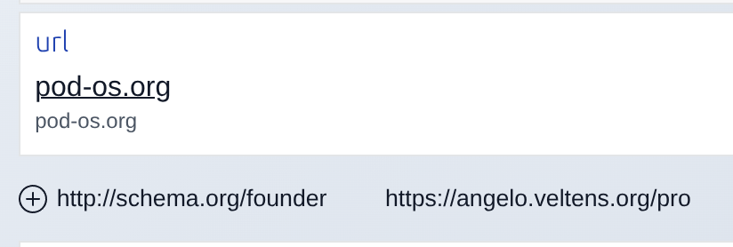
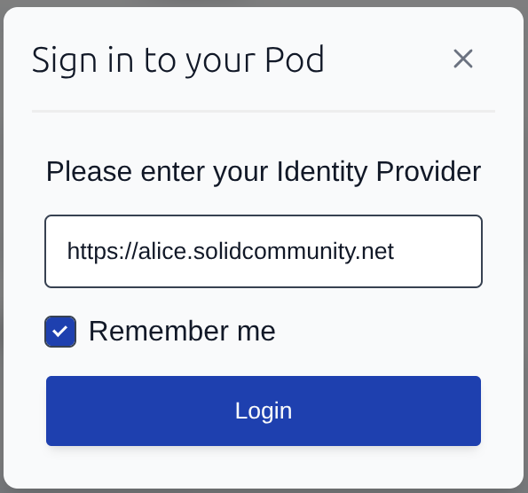

---
date:
  created: 2026-05-27
---

# PodOS 2026.05: Remember me, linking things, and IDE superpowers

This release brings a smoother login experience, a long-awaited editing feature, and a treat for everyone building HTML dashboards. As promised, we also continued rolling out reactivity to more components.

## More reactivity

In our last release we started making PodOS components react to data changes automatically. With this release, [`pos-value`](https://pod-os.org/reference/elements/components/pos-value/), [`pos-label`](https://pod-os.org/reference/elements/components/pos-label/), and [`pos-description`](https://pod-os.org/reference/elements/components/pos-description/) join the club. Edit a label in one place and every spot on the page that displays it catches up immediately.

## Link things together

Data on your Pod is richer when things are connected. Until now you could browse relations between resources, but adding a new link required editing raw RDF.

{ align=right width="300" }

PodOS Browser now lets you create a relation between two things directly from the "Data" tool, the same way you could already add literal values. Link a book to its author. Connect a project to its participants. The data is yours to shape.

## Remember me

The login form now has a **Remember me** checkbox. When checked, your Identity Provider URL is saved locally and pre-filled the next time you log in. One less thing to type.

{  width="300" }

## Auto-completion for dashboard builders

If you build HTML dashboards with PodOS elements, [your editor can now help you](../../../getting-started/editor-support.md). This release ships a [Custom Elements Manifest](https://github.com/webcomponents/custom-elements-manifest) alongside the package. IDEs that support this standard, like VS Code with the right extension, will suggest component names, attributes, and their descriptions as you type.

<figure markdown="span">
  
  <figcaption>Auto-complete suggesting various PodOS elements</figcaption>
</figure>

## Full changelogs

PodOS 2026.05 includes the following components:

- @pod-os/elements 0.41.0
- @pod-os/core 0.30.0

For those of you interested in the full list of changes, here are the release
notes:

- [@pod-os/elements](https://github.com/pod-os/PodOS/blob/2026.05/elements/CHANGELOG.md#changelog)
- [@pod-os/core](https://github.com/pod-os/PodOS/blob/2026.05/core/CHANGELOG.md#changelog)
