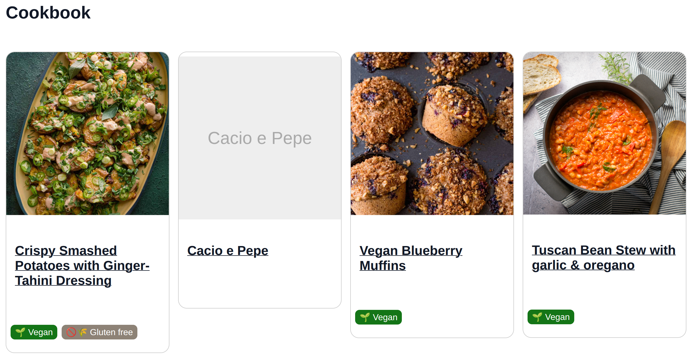

---
date:
  created: 2026-07-29
---

# PodOS 2026.07: Flexible conditions and document metadata

Our latest release makes it possible to handle document metadata and gives you more flexibility in visualizing your data with custom dashboards. 

## Access and edit document metadata

The world is messy, and more than often you get a lousy PDF instead of valuable new data for your Pod. You can upload attachments since [PodOS 2025.12,](../2025/pod-os-2025-12-attachments-and-discovery.md) and now you can enrich those documents with structured data as well! Add any literal or relation to classic documents like PDFs, Markdown notes or images and give them the *meaning* they deserve! You could upload your paper invoices, add a `schema:Invoice` type to them and a `totalPaymentDue`, link them with a respective `Order` or `Event`. Model the data to your needs, and if you like, start building dashboards to visualize all of this!

## Programming in HTML?

We know, we know... HTML is not a programming language. But what *if* you like to shape
dashboards *fitting* to your data? We introduced [
`pos-switch`](http://pod-os.org/reference/elements/components/pos-switch/)
with [PodOS 2026.03](pod-os-2026-03-open-with-and-conditional-rendering.md) and it just got more powerful. You are now
able to render different cases depending on the values of properties and even reverse relations! Consult the [pos-case](https://pod-os.org/reference/elements/components/pos-switch/pos-case/) documentation for all available attributes.

A practical example? How about a recipe dashboard that highlights your vegan recipes:

```html
<pos-switch>
    <pos-case if-property="https://schema.org/suitableForDiet"
              some-value-eq="https://schema.org/VeganDiet">
        <template>
            This is vegan!
        </template>
    </pos-case>
</pos-switch>
```

{ align=right width="300" }

You can manage your recipes with an existing app like [Umai](umai.noeldemartin.com), but Umai has no feature yet to manage dietary preferences.
Thanks to Solid, you can edit your data anyway using PodOS Brower, add a `suitableForDiet` relation and build a custom
dashboard to visualize your cookbook the way *you* prefer. Bon appétit!

Our Dashboard Garage has a [full example of such a dashboard](https://github.com/pod-os/dashboard-garage/blob/main/examples/recipes.html). Explore, mess with it, and build whatever you need.

## Full changelogs

PodOS 2026.07 includes the following components:

- @pod-os/elements 0.43.0
- @pod-os/core 0.32.0

For those of you interested in the full list of changes, here are the release
notes:

- [@pod-os/elements](https://github.com/pod-os/PodOS/blob/2026.07/elements/CHANGELOG.md#changelog)
- [@pod-os/core](https://github.com/pod-os/PodOS/blob/2026.07/core/CHANGELOG.md#changelog)
