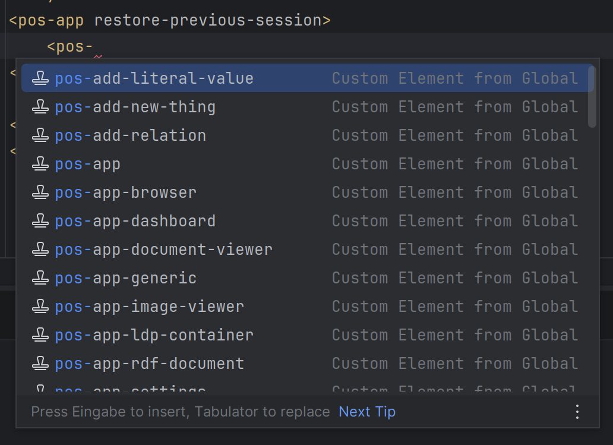
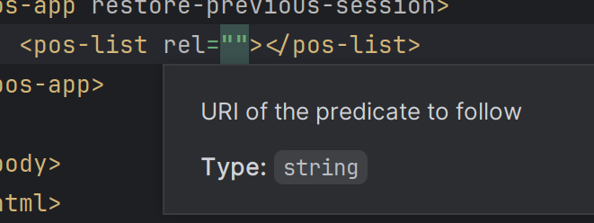

# Editor support / auto-complete

When working with PodOS elements, it is best to use an IDE like IntelliJ IDEA or Visual Studio Code. These tools make it
a lot easier to write valid HTML and can also autocomplete PodOS elements and show their documentation.

<div markdown="span" style="display: flex; justify-content: space-between; align-items: center; gap: 1rem">
    <figure markdown="span">
      
      <figcaption>Auto-complete suggesting various PodOS elements</figcaption>
    </figure>

    <figure markdown="span">
      {  width="300" }
      <figcaption>Pop-Ups show useful help, e.g. for properties</figcaption>
    </figure>
</div>

This is supported by any editor that
understands [Custom Elements Manifests](https://github.com/webcomponents/custom-elements-manifest), e.g. by installing the Web Components Toolkit.

## Install Web Components Toolkit

We recommend using the [Web Components Toolkit](https://wc-toolkit.com), which is available as a plugin for several
editors,
like [VS Code](https://wc-toolkit.com/integrations/vscode/), [JetBrains IDEs](https://wc-toolkit.com/integrations/jetbrains/), [Neovim](https://wc-toolkit.com/integrations/neovim/)
and [Zed](https://wc-toolkit.com/integrations/zed/).

When installing PodOS via `npm`, auto-completion and documentation work out of the box. When using it from CDN, you
must either download the `custom-elements.json` to your working directory or configure WC Toolkit to point to the remote
file.

Either download the manifest file:
```bash
wget https://cdn.jsdelivr.net/npm/@pod-os/elements/dist/custom-elements.json
```

or configure WC Toolkit to load it from CDN:

```js
// wc.config.js
export default {
  manifestSrc: "https://cdn.jsdelivr.net/npm/@pod-os/elements/dist/custom-elements.json"
}
```

!!! warning "You might need to restart the editor afterwards."